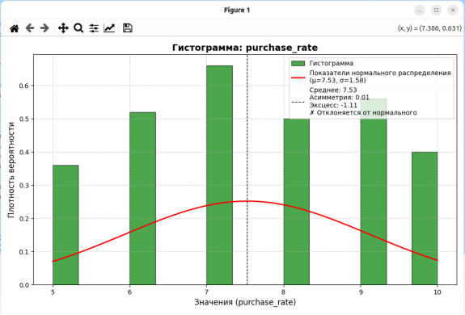
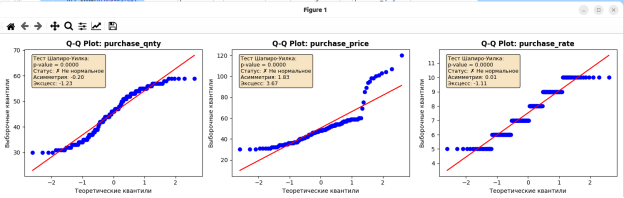
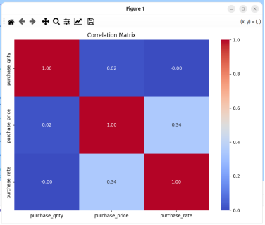

# Petshop Statistical Data Analyzer

GUI application for statistical analysis and visualization of Petshop database data.

##  Features
- **Histogram Analysis** with normal distribution curve
- **Q-Q Plots** for normality testing (Shapiro-Wilk test included)
- **Correlation Matrix** visualization with heatmap
- **Adaptive UI** - auto-detects numeric columns
- **Statistical Metrics**: skewness, kurtosis, p-values

##  Technologies
- **Python 3.10+**
- **PyQt6** - GUI framework
- **SQLite** - database
- **Pandas** - data manipulation
- **Matplotlib/Seaborn** - visualization
- **SciPy** - statistical tests

##  Visualizations Examples
| Histogram | Q-Q Plot | Correlation Matrix |
|-----------|----------|-------------------|
|  |  |  |

##  Quick Start
```bash
git clone https://github.com/VeronikaKolimova/data-visualization-and-statistical-analysis-GUI-for-Petshop-database.git
cd data-visualization-and-statistical-analysis-GUI-for-Petshop-database
pip install -r requirements.txt
python ui_db_gui.py
```
##  Related Project
https://github.com/VeronikaKolimova/Petshop-Database-Management-System
